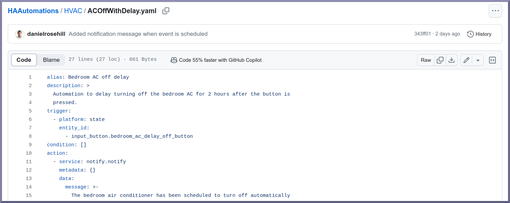
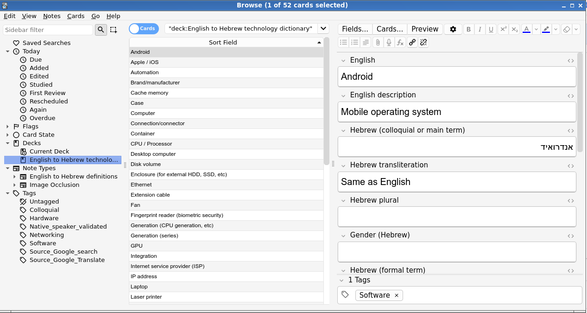

# Welcome To My Github Homepage!

Hello and welcome to my homepage on Github!

My name is Daniel and I live in Jerusalem, Israel.

This Github account contains a [rather eclectic mix of repositories](https://github.com/danielrosehill?tab=repositories&q=&type=&language=&sort=name) so I thought I would write a little note to explain what's residing here. 

## Backup Related Material

As a longtime Linux and open source user, I learned the hard way that robust backup strategies are *essential* to protecting important data!

The various backup guides here are just documentation of how I *do* backups to protect my Linux OS.

Some repos sharing that:

- https://github.com/danielrosehill/Master_Backup_Strategy
- https://github.com/danielrosehill/UbuntuBackupStrategy
- https://github.com/danielrosehill/backup_internet_israel

These are some schematics for mult-WAN internet for automatic connection failover:

- https://github.com/danielrosehill/backup_internet_israel

### Cloud/SaaS Backup

There aren't all that many sayings in IT that can be fairly described as "properly hackneyed" but "the cloud is just somebody else's computer" is probably one of them.

I try to make sure that anywhere I commit data to (including Github!) complies with the simple 3-2-1 backup yardstick (my interpretation: original + 2 copies, one of them offsite).

Consumer SaaS backup is highly under-developed. For that reason I've tried to document a few of the data export/liberation approaches offered by various services (they can't properly be described as "backup" engines).

These can be found here:

- https://github.com/danielrosehill/CloudBackupApproaches
- https://github.com/danielrosehill/CloudBackupScripts

------

## Home Assistant 

I recently (at the time of writing) set up Home Assistant on my network. 

I'm very interested in using Home Assistant to create home automations based around the Jewish religious calendar, including the weekly observance of Shabbat. 

As I figure things out, I'll occasionally share them here:

https://github.com/danielrosehill/HAAutomations

------

## English to Hebrew Vocab Flashcards For Anki

I created some Anki flashcards for learning technology related vocabulary in Hebrew.

Ideally I will keep this updated periodically but ... let's see!

- https://github.com/danielrosehill/ENHETechDictionary

------

## Tech Articles

I'm a big proponent of open-sourcing information, particularly as it relates to technology.

Whenever I figure out something difficult ... I try to jot down some instructions. 

I do this partially for my own purposes. And partially because I figure it might help somebody out.

For the most part, I find video the best medium for doing this. 

My tech channel on YouTube is called Daniel's Tech World and [can be found here.](https://www.youtube.com/@danielontech)

I've also uploaded how-tos to Hackster, Github, Medium, and elsewhere.

- https://www.youtube.com/channel/UCQ1TBIr0NOQsWiQtil8OAjw
- https://github.com/danielrosehill/TechnicalArticles
- https://www.hackster.io/danielrosehill/
- https://medium.com/daniels-tech-world

------

## Paleo Hebrew

Hebrew has not always been written in the characters that are familiar to many today!

I learned to read Paleo Hebrew for my wedding (which had a Biblical vibe!). 

I also printed *birkonim* (after meal prayer books) in interlinear Proto-Ashurit-English.

The document project files and a few other goodies are here:

- https://github.com/danielrosehill/PaleoHebrew

------

## Impact Investing Research 

I currently work in the field of impact investing and believe that transparency around companies' holistic impacts, on people and planet, would be a huge step forward. 

The repositories I am working on for impact investing aim to centralise some data releases related to tentative methodologies to make such data available. 

Some of the data presented includes releases from:

- [International Foundation for Valuing Impacts (IFVI)](https://ifvi.org/)
- Impact Weighted Accounts Initiative (IWAI)
- [GO Lab at Brookings](https://golab.bsg.ox.ac.uk/knowledge-bank/indigo/) 

The repositories are:

Impact Weighted Accounts
